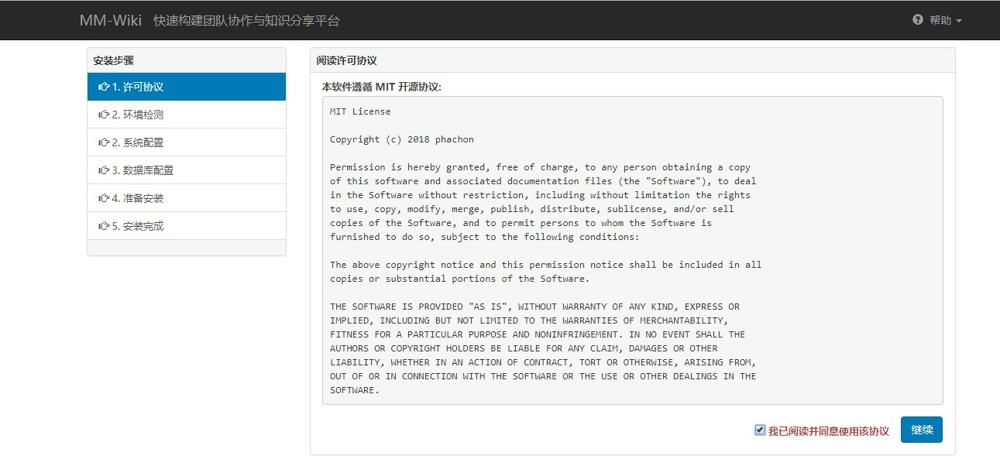
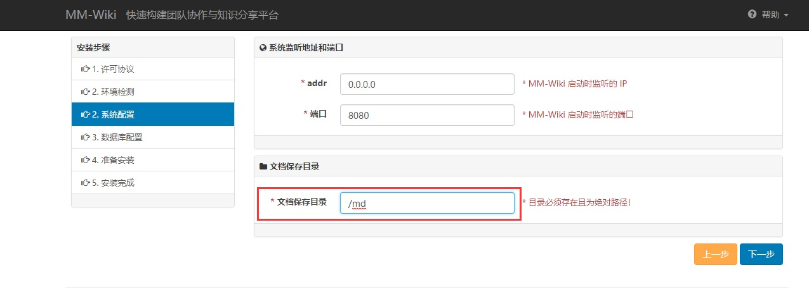
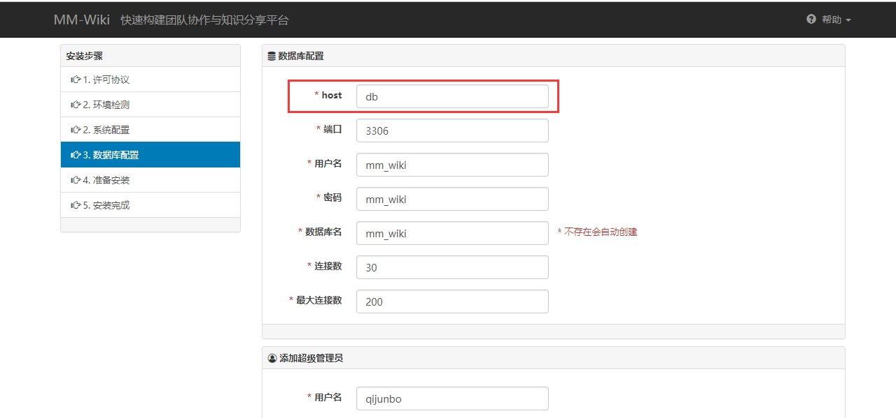
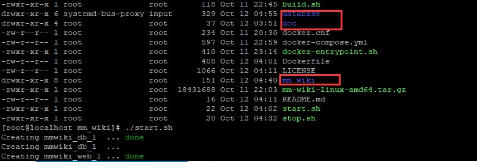

# docker_mm_wiki

Precondition
--

You have docker installed and you have docker-compose installed.

install docker on CentoS, click [here](https://docs.docker.com/install/linux/docker-ce/centos/)

if you have yet have docker-compose installed , find manual [here](https://docs.docker.com/compose/install/) 

Usage:
--


- Download the latest version of (MM_wiki)[mm-wiki-linux-amd64.tar.gz](https://github.com/phachon/mm-wiki/releases/download/v0.1.1/mm-wiki-linux-amd64.tar.gz) from [here](https://github.com/phachon/mm-wiki/releases) we will need this file when we make the docker image.

```
wget https://github.com/phachon/mm-wiki/releases/download/v0.1.7/mm-wiki-v0.1.7-linux-amd64.tar.gz -O  mm-wiki-linux-amd64.tar.gz 
```

- Run the ``` build.sh ``` script to create the docker image.

- Run the ``` start.sh ``` script to run the docker-compose file.  

- To install the mm_wiki in docker ,  click http://ipaddress:8090/
  
- Accet the MIT License to continue.

- And you don NOT need to change anything at the SECOND step, click next.

- Make sure the document save path is ``` /md ``` because it is written in the Dockerfile. It's a path inside the docker container, not in the host outside , don't take it wrong.

- Make sure the DB ``` host ``` name is db,  because it's written in the docker-compose.yml. fill the rest of the blanks whatever value you like.  And don't forget the admin user name after you finish the installation.   

Note: It seems that the password does Not accept characters like ( _ $ ^ ) maybe. 

- It's done. enjoy.

- execute the ``` stop.sh ``` to shut down the container, then ``` start.sh ```
- Then, the link  http://ipaddress:8090/  is disabled, the wiki is ready for use at  http://ipaddress:8080/ 


Uninstall
--

- If you may encountered anything wrong , want to restart over. it's easy.  look at these three folders in this picture,  they are created automatically after you run ``` start.sh ``` execute ``` stop.sh ``` first, and then remove the three folders, and run ``` start.sh ``` to re-config.




How to contribute
--

- feedback is a gift.  you are always welcome to give me suggestion by mail me at junboqi@foxmail.com   I usually check my mail box once a week.

- Welcome to Pull Requests at github !

